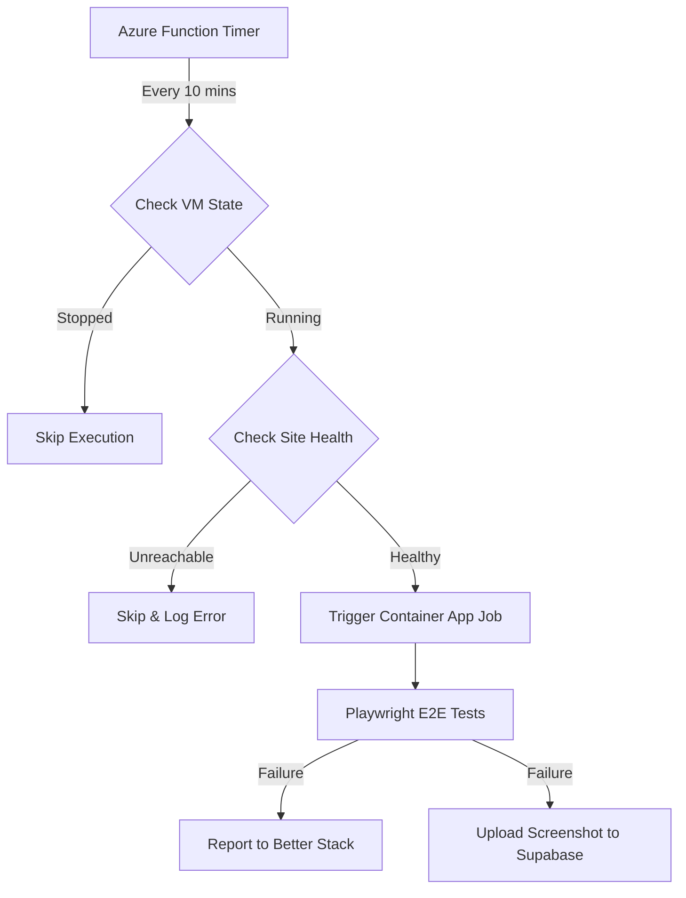

# 🛰️ ESMOS Monitoring Monorepo

> Unified repository managing the end-to-end monitoring pipeline for the [Everyday Sustainable Meals Ordering System (ESMOS)](http://prod-v3.eastasia.cloudapp.azure.com:8069/).

## 🏗️ Project Structure

This monorepo uses **pnpm workspaces** to manage two core components of the ESMOS monitoring stack and **pnpm catalogs** for shared dependencies:

| Package             | Directory                                          | Description                                                                  |
| :------------------ | :------------------------------------------------- | :--------------------------------------------------------------------------- |
| **ESMOS Monitor**   | [`packages/monitor`](./packages/monitor/README.md) | Playwright E2E test suite running in an Azure Container App Job.             |
| **Monitor Trigger** | [`packages/trigger`](./packages/trigger/README.md) | Azure Function (Timer) that gates monitor execution based on VM power state. |

## 💡 Architecture Overview

The system is designed to be **conditionally triggered** to save costs and avoid false positives when the production environment is deallocated:



## 🚀 Quick Start

### Prerequisites

- [Node.js](https://nodejs.org/) `>= 22.x`
- [pnpm](https://pnpm.io/) `>= 10.x`
- [Azure CLI](https://learn.microsoft.com/en-us/cli/azure/) (for local Azure auth)

### Installation

```bash
# Install all dependencies across the workspace
pnpm install
```

### Common Commands

You can run commands for specific packages from the root using the `--filter` flag:

**Monitor (E2E Tests):**

```bash
# Run tests locally (dev mode)
pnpm --filter esmos-monitor test:dev
```

**Trigger (Azure Function):**

```bash
# Build the function
pnpm --filter esmos-monitor-trigger build

# Start the function locally
pnpm --filter esmos-monitor-trigger start
```

## 🛠️ Tech Stack

- **Core**: TypeScript, pnpm Workspaces
- **Testing**: Playwright
- **Serverless**: Azure Functions
- **Observability**: Pino, Sentry (Better Stack Errors/Logs)
- **Infrastructure**: Azure Container Apps, Azure VM

## 📄 License

This project is part of the IS214 Enterprise Solution Management coursework.
