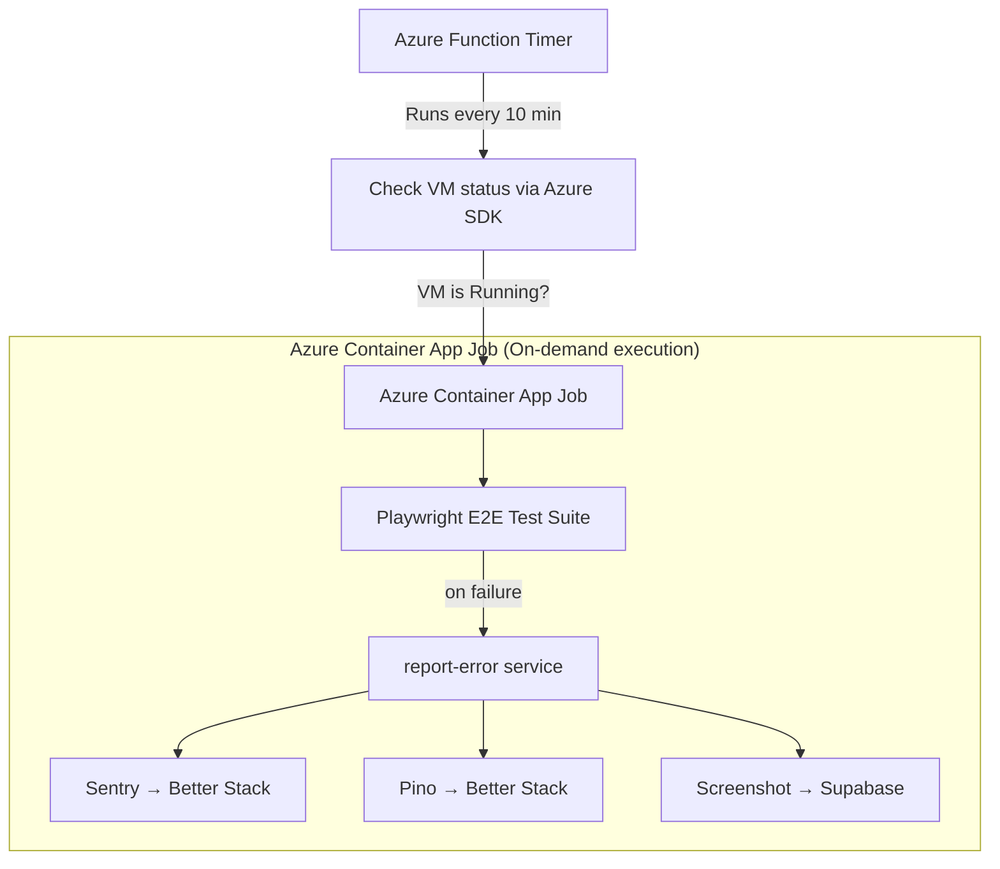
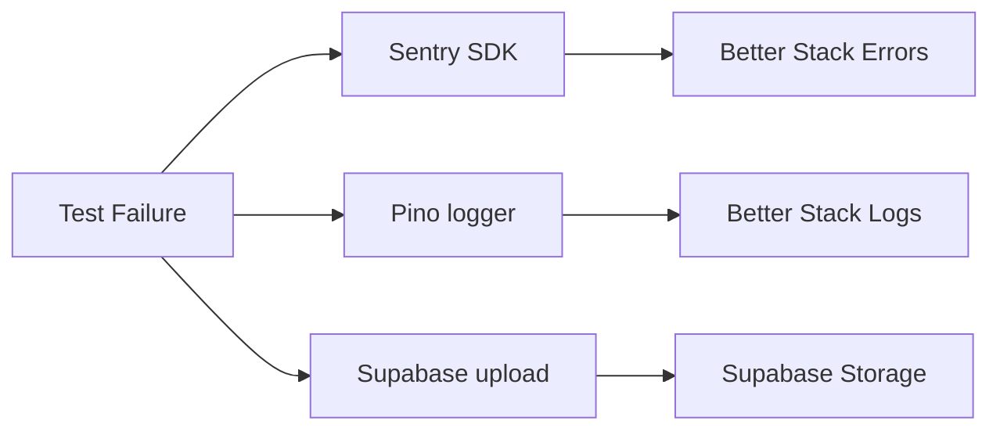
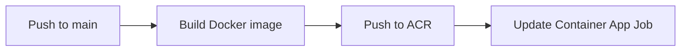

# 🛡️ Package: ESMOS Monitor

> Playwright-powered E2E test suite for the [ESMOS](http://prod-v3.eastasia.cloudapp.azure.com:8069/) platform, deployed as an Azure Container App Job.

## 💡 Why This Exists

G8T1's existing monitoring stack uses [Better Stack Uptime](https://betterstack.com/uptime) for availability checks and [Azure Alerts](https://azure.microsoft.com/en-us/products/monitor/alerts) for infrastructure health. However, neither approach validates the **actual user experience**—a page can return HTTP 200 while rendering a blank screen or hiding a broken form.

ESMOS Monitor fills that gap by running headless Playwright tests against the production UI on a 10-minute cadence, verifying that critical user journeys work end-to-end. When a test fails, the pipeline automatically:

1. Captures a screenshot and uploads it to **Supabase Storage**.
2. Reports the error to **Better Stack Errors** via the Sentry SDK.
3. Logs structured context to **Better Stack Logs** via Pino.

## 🏗️ Architecture



The scheduling and execution layers are intentionally **decoupled**:

| Layer         | Component          | Purpose                                                                                |
| ------------- | ------------------ | -------------------------------------------------------------------------------------- |
| **Trigger**   | `packages/trigger` | Checks if the target VM is running before triggering the job, avoiding wasted compute. |
| **Execution** | `packages/monitor` | Runs the Playwright test suite inside a container. No environment checks—just tests.   |

## 🛠️ Tech Stack

| Category       | Technology                                                                                         |
| -------------- | -------------------------------------------------------------------------------------------------- |
| Language       | [TypeScript](https://www.typescriptlang.org/) (ES2022, strict mode)                                |
| Testing        | [Playwright](https://playwright.dev/) v1.58                                                        |
| Error Tracking | [Sentry SDK](https://sentry.io/) → [Better Stack Errors](https://betterstack.com/errors)           |
| Logging        | [Pino](https://getpino.io/) → [Better Stack Logs](https://betterstack.com/logs)                    |
| Storage        | [Supabase Storage](https://supabase.com/storage) (failure screenshots)                             |
| Env Validation | [Zod](https://zod.dev/) + [T3 Env](https://env.t3.gg/)                                             |
| Container      | Docker ([`mcr.microsoft.com/playwright`](https://mcr.microsoft.com/en-us/artifact/mar/playwright)) |
| CI/CD          | GitHub Actions → Azure Container Registry → Azure Container App Job                                |
| Code Quality   | Prettier, Husky, lint-staged                                                                       |

## 🚀 Getting Started

### ✅ Prerequisites

| Tool                              | Version                            |
| --------------------------------- | ---------------------------------- |
| [Node.js](https://nodejs.org/)    | `>= 22.14.0`                       |
| [pnpm](https://pnpm.io/)          | `>= 10.20.0`                       |
| [Docker](https://www.docker.com/) | Latest (for container builds only) |

### 📦 Setup

This package is part of the [ESMOS Monitoring Monorepo](../../README.md).

```bash
# From the monorepo root
pnpm install
```

### ⚙️ Configuration

Copy the example environment file and fill in the required values:

```bash
cp .env.example .env
```

| Variable                   | Description                                               |
| -------------------------- | --------------------------------------------------------- |
| `NODE_ENV`                 | `development` or `production`                             |
| `FORCE_COLOR`              | Set to `false` to disable ANSI color in Playwright output |
| `BETTER_STACK_ERROR_DSN`   | Sentry-compatible DSN for Better Stack Errors             |
| `BETTER_STACK_ERROR_TOKEN` | Auth token for Better Stack Errors                        |
| `BETTER_STACK_LOGS_DSN`    | Endpoint URL for Better Stack Logs                        |
| `BETTER_STACK_LOGS_TOKEN`  | Source token for Better Stack Logs                        |
| `SUPABASE_URL`             | Supabase project URL                                      |
| `SUPABASE_SECRET_KEY`      | Supabase service-role secret key                          |
| `ADMIN_PASSWORD`           | Password used to test multi-role login flows              |

> [!NOTE]
> Environment variables are validated at startup using [T3 Env](https://env.t3.gg/) with Zod schemas (see [`server/env.ts`](server/env.ts)). Missing or invalid values will cause an immediate, descriptive error.

## 🧑‍💻 Usage

**Run tests locally** (loads env from `.env.production` via `dotenv-cli`):

```bash
# From this directory
pnpm run test:dev

# Or from the root
pnpm --filter esmos-monitor test:dev
```

**Build and run via Docker** (mirrors production):

```bash
pnpm run build:docker
docker run --env-file .env esmos-monitor
```

## 🧪 Test Coverage

All E2E tests live in [`server/tests/e2e/`](server/tests/e2e/) and target the production ESMOS application.

| Test Suite         | File               | What It Verifies                                                                                                                                       |
| ------------------ | ------------------ | ------------------------------------------------------------------------------------------------------------------------------------------------------ |
| **Homepage**       | `homepage.test.ts` | Navigation, hero section, feature blocks, footer links, contact details, social media                                                                  |
| **Authentication** | `login.test.ts`    | Login form rendering, multi-role login (System Configurator, Product Manager, Data Manager, Security Manager, Support Manager), post-login redirection |
| **Shop**           | `shop.test.ts`     | Product grid (10 items), individual product detail pages (name, price), search bar, sort controls                                                      |
| **Contact Us**     | `contact.test.ts`  | Form submission (success + validation errors), sidebar contact info (phone, email, company), navigation flow                                           |
| **Services**       | `services.test.ts` | Service highlights, quotes carousel, customer testimonials                                                                                             |

**Playwright configuration** ([`playwright.config.ts`](playwright.config.ts)):

- Browser: Chromium (Desktop Chrome device profile)
- Workers: 4 (fully parallel)
- Retries: 2 (in case of flakiness)
- Screenshots: captured on first failure
- Traces: captured on first retry

## 📡 Monitoring & Observability

When a test fails, the [`report-error`](server/services/report-error.ts) service orchestrates a three-pronged response:



Each failure record includes the test title, status, duration, retry count, annotations, sanitized error message, and stack trace (with ANSI codes stripped for readability).

## 🔄 CI/CD

The GitHub Actions workflow ([`.github/workflows/monitor-deploy.yml`](../../.github/workflows/monitor-deploy.yml)) automates deployment on every push to `main`:



| Step       | Detail                                                                  |
| ---------- | ----------------------------------------------------------------------- |
| **Build**  | Multi-tag Docker image (`latest` + commit SHA)                          |
| **Push**   | Azure Container Registry (ACR)                                          |
| **Deploy** | `az containerapp job update` targeting the `esmos-monitor-job` resource |
| **Auth**   | OIDC with Azure Managed Identity (keyless, no stored credentials)       |

The workflow also supports `workflow_dispatch` for manual deployments.

## 📂 Project Structure

```
esmos-monitor/
├── .github/workflows/
│   └── aca-deploy.yml          # CI/CD pipeline
├── server/
│   ├── env.ts                  # Environment validation (T3 Env + Zod)
│   ├── lib/
│   │   ├── pino.ts             # Logger setup (Pino → Better Stack + pretty-print)
│   │   ├── sentry.ts           # Sentry initialization
│   │   └── supabase.ts         # Supabase client
│   ├── services/
│   │   ├── report-error.ts     # Error reporting orchestrator
│   │   └── upload-screenshot.ts # Screenshot upload to Supabase Storage
│   └── tests/e2e/
│       ├── homepage.test.ts
│       ├── login.test.ts
│       ├── shop.test.ts
│       ├── contact.test.ts
│       └── services.test.ts
├── Dockerfile                  # Production container (Playwright base image)
├── playwright.config.ts        # Test runner configuration
├── package.json
├── tsconfig.json               # Strict TypeScript configuration
└── .env.example                # Environment variable template
```

## 📄 License

This project is part of the IS213 Enterprise Solution Management coursework.
