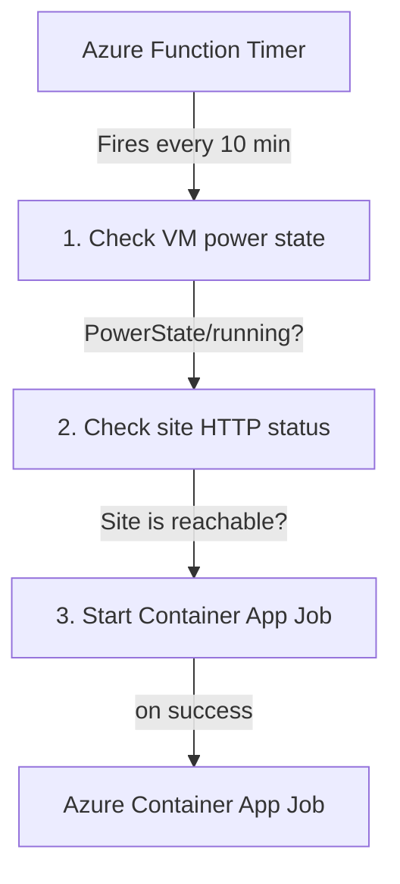
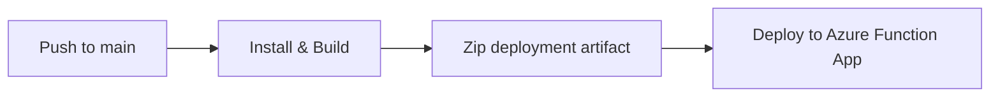

# ⏱️ Package: ESMOS Monitor Trigger

> Azure Function (Timer Trigger) that conditionally starts the [ESMOS Monitor](../monitor) Container App Job based on the production VM's power state.

## 💡 Why This Exists

The [ESMOS Monitor](https://github.com/zek01svg/esmos-monitor) Container App Job runs Playwright E2E tests against the production UI every 10 minutes. However, the production VM hosting ESMOS is not always online—it may be deallocated outside of class hours to save costs. Running the job while the VM is down wastes compute, triggers false-positive failures, and floods the error-tracking pipeline.

ESMOS Monitor Trigger solves this by acting as a **conditional gate**. On every tick of its 10-minute timer, it:

1. Queries the **Azure Compute API** for the VM's current power state.
2. If the VM is `Running`, checks the HTTP status of the target ESMOS application.
3. If the site is reachable, starts the Container App Job via the **Azure Container Apps API**.
4. If the VM is stopped/deallocated or the site is unreachable, skips execution and logs the decision.

This keeps the scheduling and execution layers **fully decoupled**—the Function knows nothing about Playwright, and the Container App Job knows nothing about VM status.

## 🏗️ Architecture



The two components are owned by separate repositories and deployed independently:

| Layer         | Component          | Repository | Purpose                                                                          |
| ------------- | ------------------ | ---------- | -------------------------------------------------------------------------------- |
| **Trigger**   | `packages/trigger` | This       | Checks VM status and site health, conditionally starts the job. No test logic.   |
| **Execution** | `packages/monitor` | Monitor    | Runs Playwright tests, reports errors, uploads screenshots. No scheduling logic. |

## 🛠️ Tech Stack

| Category       | Technology                                                                                                                                                                                                                           |
| -------------- | ------------------------------------------------------------------------------------------------------------------------------------------------------------------------------------------------------------------------------------ |
| Runtime        | [Azure Functions](https://learn.microsoft.com/en-us/azure/azure-functions/) v4 (Node.js, Timer Trigger)                                                                                                                              |
| Language       | [TypeScript](https://www.typescriptlang.org/) (ES2020, strict mode)                                                                                                                                                                  |
| Azure SDKs     | [`@azure/arm-compute`](https://www.npmjs.com/package/@azure/arm-compute) · [`@azure/arm-appcontainers`](https://www.npmjs.com/package/@azure/arm-appcontainers) · [`@azure/identity`](https://www.npmjs.com/package/@azure/identity) |
| Auth           | [`DefaultAzureCredential`](https://learn.microsoft.com/en-us/javascript/api/@azure/identity/defaultazurecredential) (Managed Identity in production, Azure CLI locally)                                                              |
| Error Tracking | [Sentry SDK](https://sentry.io/) → [Better Stack Errors](https://betterstack.com/errors)                                                                                                                                             |
| Logging        | [Pino](https://getpino.io/) → [Better Stack Logs](https://betterstack.com/logs)                                                                                                                                                      |
| CI/CD          | GitHub Actions → Azure Functions Action (zip deploy)                                                                                                                                                                                 |
| Code Quality   | Prettier, Husky                                                                                                                                                                                                                      |

## 🚀 Getting Started

### ✅ Prerequisites

| Tool                                                                                                      | Version      |
| --------------------------------------------------------------------------------------------------------- | ------------ |
| [Node.js](https://nodejs.org/)                                                                            | `>= 22.x`    |
| [pnpm](https://pnpm.io/)                                                                                  | `>= 10.20.0` |
| [Azure Functions Core Tools](https://learn.microsoft.com/en-us/azure/azure-functions/functions-run-local) | `v4`         |
| [Azure CLI](https://learn.microsoft.com/en-us/cli/azure/)                                                 | Latest       |

### 📦 Setup

This package is part of the [ESMOS Monitoring Monorepo](../../README.md).

```bash
# From the monorepo root
pnpm install
```

### ⚙️ Configuration

Configure `local.settings.json` with the required values:

**Azure Resources**

| Variable                   | Description                                                      |
| -------------------------- | ---------------------------------------------------------------- |
| `AZURE_SUBSCRIPTION_ID`    | Azure subscription containing the VM and Container App resources |
| `AZURE_VM_RESOURCE_GROUP`  | Resource group of the target production VM                       |
| `AZURE_VM_NAME`            | Name of the production VM to monitor                             |
| `AZURE_ACA_RESOURCE_GROUP` | Resource group of the Container App Job                          |
| `AZURE_ACA_JOB_NAME`       | Name of the Azure Container App Job to trigger                   |
| `ESMOS_URL`                | URL of the deployed ESMOS application to monitor                 |

**Observability**

| Variable                   | Description                                   |
| -------------------------- | --------------------------------------------- |
| `BETTER_STACK_ERROR_DSN`   | Sentry-compatible DSN for Better Stack Errors |
| `BETTER_STACK_ERROR_TOKEN` | Auth token for Better Stack Errors            |
| `BETTER_STACK_LOGS_DSN`    | Endpoint URL for Better Stack Logs            |
| `BETTER_STACK_LOGS_TOKEN`  | Source token for Better Stack Logs            |

> [!NOTE]
> When running locally, the Function uses `DefaultAzureCredential` which resolves to your Azure CLI login (`az login`). In production, it authenticates via the Function App's **System-Assigned Managed Identity**, which must have the following RBAC roles:
>
> - `Virtual Machine Reader` on the target VM (or its resource group)
> - `ContainerApp Jobs Contributor` on the Container App Job (or its resource group)

## 🧑‍💻 Usage

**Run locally** with Azure Functions Core Tools:

```bash
# From this directory
pnpm run build
pnpm run start

# Or from root
pnpm --filter esmos-monitor-trigger build
pnpm --filter esmos-monitor-trigger start
```

The timer trigger fires every 10 minutes. For local testing, the function is also invocable via an HTTP `POST` to the admin endpoint:

```bash
curl -v -X POST http://localhost:7071/admin/functions/CheckVmAndTriggerJob -H "Content-Type: application/json" -d "{}"
```

## 📡 Monitoring & Observability

Every invocation produces structured logs through both the Azure Functions context logger and Pino:

```
Timer fired → VM Status: Running → Checking site status... → Job successfully triggered.
Timer fired → VM Status: Running → Checking site status... → VM is running but site is down. Skipping execution.
Timer fired → VM Status: VM deallocated → Skipping execution.
```

When an error occurs (e.g., insufficient permissions, network failure), the function:

1. Captures the exception in **Sentry** → forwarded to **Better Stack Errors**.
2. Logs the error with full context via **Pino** → streamed to **Better Stack Logs**.

Both channels share the same Better Stack workspace as the [ESMOS Monitor](https://github.com/zek01svg/esmos-monitor) Container App Job, providing a **unified view** of the entire monitoring pipeline.

## 🔄 CI/CD

The GitHub Actions workflow ([`.github/workflows/trigger-deploy.yml`](../../.github/workflows/trigger-deploy.yml)) automates deployment on every push to `main`:



| Step        | Detail                                                                                             |
| ----------- | -------------------------------------------------------------------------------------------------- |
| **Build**   | Install dependencies (`pnpm install --frozen-lockfile`), compile TypeScript, prune devDependencies |
| **Package** | Zip the deployment artifact, excluding source files, config, and git metadata                      |
| **Deploy**  | Zip deploy to `esmos-monitor-trigger` Azure Function App using `Azure/functions-action@v1`         |
| **Auth**    | OIDC with Azure service principal (federated credentials, no stored secrets)                       |

The workflow also supports `workflow_dispatch` for manual deployments.

## 📂 Project Structure

```
esmos-monitor-trigger/
├── .github/workflows/
│   └── deploy.yml                  # CI/CD pipeline (GitHub Actions → Azure Functions)
├── src/
│   ├── index.ts                    # Azure Functions app entry point
│   ├── functions/
│   │   └── esmos-monitor-trigger.ts # Timer trigger: VM check → job start
│   └── lib/
│       ├── pino.ts                 # Logger setup (Pino → Better Stack + pretty-print)
│       └── sentry.ts              # Sentry initialization (→ Better Stack Errors)
├── host.json                       # Azure Functions host configuration
├── local.settings.json             # Local development settings (gitignored values)
├── .funcignore                     # Files excluded from function deployment
├── package.json
├── tsconfig.json                   # Strict TypeScript configuration (ES2020)
└── pnpm-lock.yaml
```

## 📄 License

This project is part of the IS213 Enterprise Solution Management coursework.
